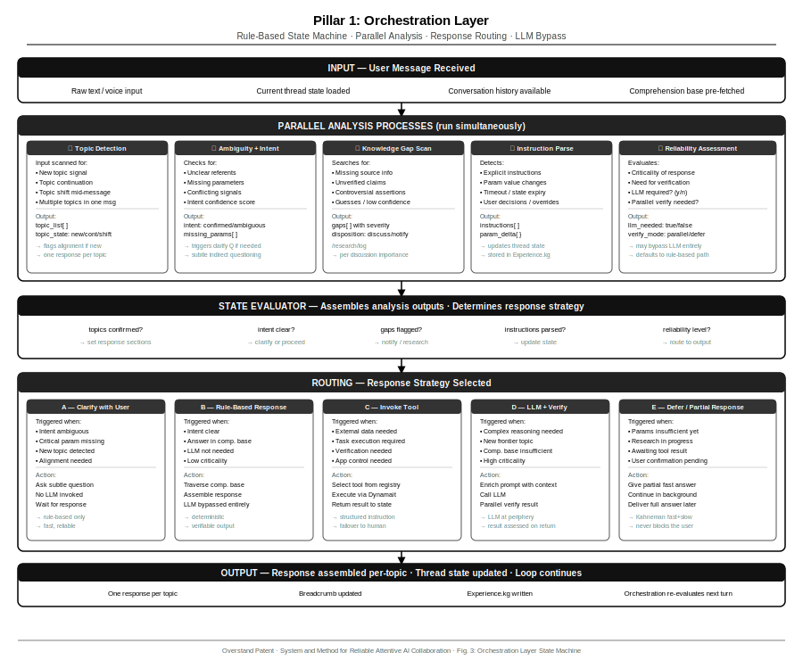
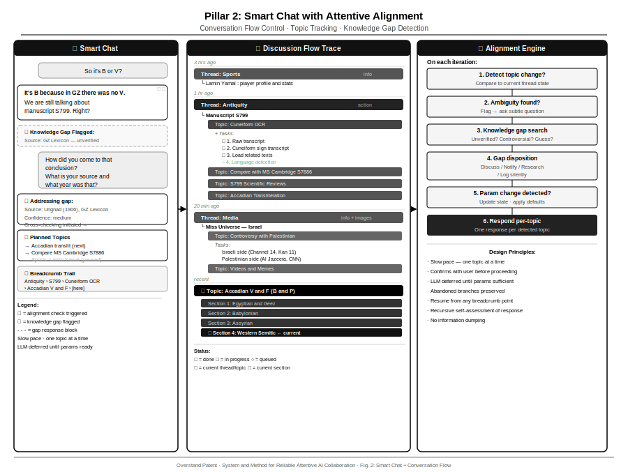
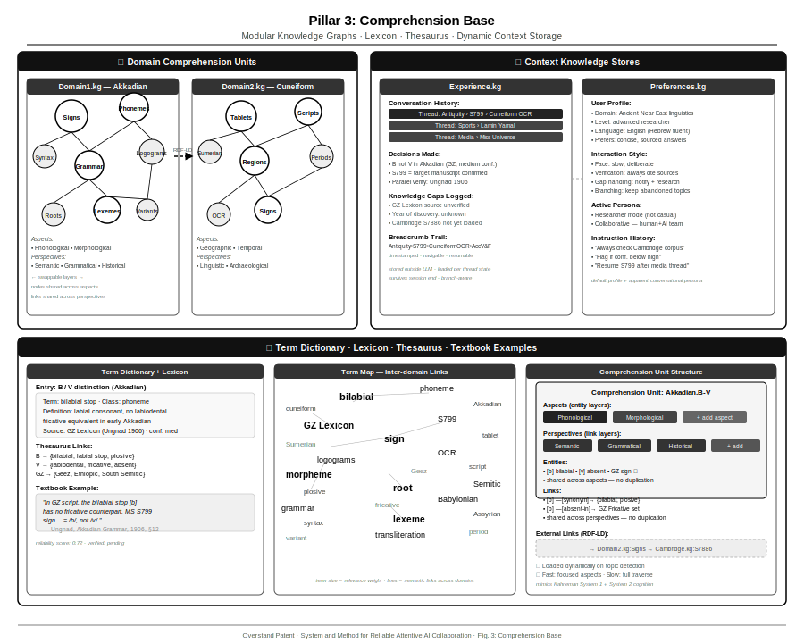
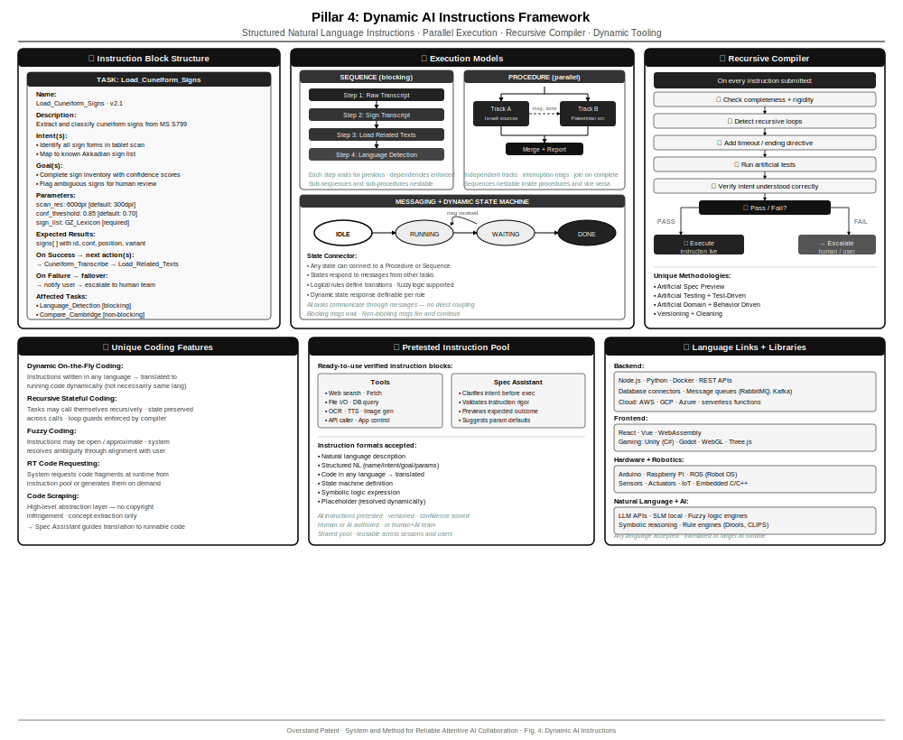

# System and Method for Reliable Attentive AI Collaboration

## Abstract

A computer-implemented system and method for providing reliable, attentive AI assistance through active, context-aware collaboration with a user.

These traits are achieved through a four-legged framework designed to move language models to the periphery, allowing them to assist as supportive collaborators without dominating the logic of the discussion.

While each leg is designed to stand on its own, their collective strength provides a robust foundation for truly deep AI, capable of executing intricate, highly complex, multi-stage tasks, and long-term operations, aligned to the original intent.

Instead of unpredictable outputs that drift off-course — surprising us with failed understandings at the most critical moments — the proposed system ensures logically cohesive responses, achieved through a transparent, attentive steering process that prioritizes reliability over unvetted immediacy, allowing the system to progress stage-by-stage at the user's deliberate pace.

## Schematics

## Four components

1. The first leg: **Logic behind the conversation:**

The results of this system are coherent and cohesive because they are constructed logically.

They are logical due to a foundational pullout from AI controlling the conversation, to a rule-based or grounded external discussion-managing component, that aligns with the user, interprets the questions and results into clear instructions, before reaching out to the AI, if at all.

2. The second leg: A **smart chat** with **attentive alignment** — asking the right questions.

The system supplies responsible and steerable results because these results are coherent and cohesive. This is achieved by reversing the direction of information flow, instead of answering the users questions, it is focused on asking the user the right questions.

The focus is on a Human-and-AI team, with the AI "caring" about the human's responses, slowly and attentively aligning itself with the user through discussions, while recursively assessing its own responses, rather than fetching huge amounts of possibly irrelevant information, and instead of missing and skipping over the typical shifts in focus and understanding during a conversation.

The smart chat **follows the conversation,** deeply understands it. It knows what the current topic is, what the general discussion is and was about, remembers a summary of previous discussions, and knows what's planned ahead after discussing it with the user.

The conversation is held in threads, not single iterations of request response. The responses from the AI are given only after a conversation with enough accumulated parameters so that a large language model would be good at solving it. Until then other methods are used.

When critical information is needed other tools are chosen. When the AI is given its chance it will usually be with some sort of parallel verification. Guesses and knowledge gaps are reported, and worked around with the user, as a **human and AI team.**

The smart chat doesn't let the conversation drown the user in information. It moves at a slow pace, getting feedback for each iteration, and with its long term smart-contextual capabilities can bring the user back on track, while allowing for in depth drill-downs, dealing with distractions of any kind.

3. The third leg is the **Comprehension base** and using it for **Smart context.** The basis for all the knowledge in the system is logic and comprehension.

**3a. Structure:**

The comprehension base is a large set of small specialized knowledge graphs (herein "comprehension units") tied into each other, with swappable node entity-base layers (herein "aspects") and swappable connection link sets (herein "perspectives") representing small ontologies, each being a lexicon with a thesaurus.

A comprehension unit stores the terms, concepts, phrases, sequences and rules needed for a certain type of discussion on a certain topic or area.

Entities in an aspect layer may point to other entities within or outside the aspect using specific or general links.

The resulting small, tightly interconnected modular inter-domain network units relevant to the anticipated field of knowledge domain or specific topic can be prepared dynamically for rapid availability or loaded into memory for immediate access.

Semantic, pragmatic, and logical connections are found by traversing the different comprehension bases and loading different connections linking everything to everything.

Quick partial answers can be given immediately, and slower more accurate results can come in later, this time with traceable logical and verifiable conclusions mimicking human cognition as described in Daniel Kahneman's book Thinking Fast and Slow (2011).

**3b. Smart context:**

The same comprehension base of lexicon-thesaurus "textbooks" for any field of discussion, are used for storing the personal choices and preferences, the chats themselves along with their analysis and breakdown.

Thus the smart chat can be familiar with the user's preferences and knowledge, and keep the chat on track, and follow up on abandoned branches of the discussion.

4. The fourth and last leg: **Dynamic tooling:** The proposed system offers the AI an opportunity to "program" its own sequences and procedures to access and manipulate the information and follow long complex modular tasks. These tasks are controlled primarily through voice and natural language text controls. This opens up a whole new set of AI capabilities effectively changing the AI application lock-in and even general "application lock-in" where you need a certain application to accomplish things in software.

Each leg stands on its own, and brings with it a small revolution:

1. Smart chat with discussion flow control helps give reliable answers and stay on track. Continuing from where you reached, and exploring where you previously left off.

2. The aligning AI knows what it doesn't know, and helps you change that. It studies new fields with you, and discovers interesting things through collaboration.

3. Dynamic code and complex task execution allows the AI to program anything. It also allows the AI to share its coding with human non-professional users.
Just three examples of what could be accomplished by this:

   - A new type of chat, that remembers your calendar and tasks, or follows your health, subtly or explicitly reminding you how long you've been at the computer, or what needs to be done.

   - New types of OCR and text to speech out of existing code, that create a mid layer of phonetic or visual edge translation, and then consolidate it with context, known sources, and statistical models, while having better collaboration with the user.

4. Comprehension base modules (Comprehension units) will eventually lead to the replacement of raw trained neural networks, and issue in the use of human explainable and verifiable directed logic models instead.

5. The legal procedures that may be implemented with a transparent system like this, are discussed briefly at the end of the claims section. The exact details are yet to be determined but a tightly protected legal binding can allow the automatic system to serve on behalf of a user, trusted by both the user and the institutions being accessed in the user's name.

The self-standing applications are mentioned at the end of the claims.

1. Comprehension base — replacing LLM usage. Yet to see how successful this is, and how practical.

2. Voice and Text control as new type of general app UI. The ability to control any app with or without an API from a chat.

3. Reliable robotic legal representation. This depends on two things: (1) That the claims for reliability with this theoretical method are met in the real world. In theory, there is no difference between theory and the real world. (2) That a legal system is set in place.

---

## Specification

### Background

Current AI systems are searching for a way to eliminate the flaws plaguing LLM systems, such as hallucination, bad guesses, loss of context, misunderstandings, incomprehensive or incohesive replies.

The software in this invention takes a different approach. Use LLMs for what they are good at. Understand most of the chat with a language model which is logical at its base. You'll always have the chance to try the LLM at your leisure.

We have tried using AI itself to achieve some of the steps such as flow. This has many disadvantages, the least of them that AI is not good at it. It often mixes up instructions and requested content. Gemini for example had no context of where it was being used, and began telling everyone what the topic was when we just called hey google.

### Summary

Reliable Attentive AI Collaboration is achieved by moving the LLM into second place, instead having a hybrid rule-based and local SLM **Smart chat** program.

It reads the prompts and interacts with the user before ever meeting the LLM, collaborating with the user to determine what has been requested, it follows the discussion with its changing topics and branching threads, it plans the anticipated topics and pre-fetches the "comprehension base" for anticipated fields of knowledge, and notifies the user about unreliable data, and can follow extremely complex sequences and procedures to reliably retrieve data, manipulate it and present it.

### Detailed Description

---

## Claims

1. A system and method for **reliable and verifiable attentive AI collaboration.**

---

#### Orchestration layer

2. The system of claim 1, wherein a continuously operating **orchestration layer** receives and analyzes each user request within its current conversation context, determines the required response strategy, selects appropriate tools and task sequences, and evaluates the criticality and reliability requirements of the response — including whether to seek clarification or confirmation from the user prior to responding — and wherein said layer may defer or bypass invocation of a language model entirely based on said evaluation.

3. The system of claim 2, wherein the orchestration layer is implemented primarily with rule-based or logical instructions, for reasons of stability, robustness and reliability.

4. The system of claim 2, wherein the orchestration layer may additionally employ artificial intelligence, fuzzy logic, or other non-deterministic methods as secondary tools for determining its direction.

5. The system of claim 2, wherein the orchestration layer may itself be built with non-deterministic methods, such as LLMs or fuzzy logic, provided a reliable verification method is in place, and defaulting back to a deterministic method upon failure is available.

6. The system of claim 2, wherein the orchestration layer operates continuously throughout the conversation, re-evaluating the response strategy at each turn, in accordance with the thread state.

---

#### Conversation-flow control

7. The system of claim 1, with one or more **conversation-flow control** software components, which detect and follow where the conversation is currently at, where it came from, and where it might be going or planned to go.

8. The conversation-flow control component of claim 7 implemented with an orchestration module, as described in the method of claim 2, possibly along with one or any group of its subsequent claims (3–6).

9. The conversation-flow control component of claim 7, wherein the elements being traced may be threads, topics, intents, goals, subjects, terms, key phrases, discussion branches, summaries, decisions made, associations, information sources and verification sources, domains of knowledge, described or implied scenarios, conversation meta-data like timestamps, ids and votes, human or automatically assigned tags such as grammar markers, importance scores, and links to related discussions.

10. The conversation-flow control component of claim 7, wherein the elements being traced are **response-creation tasks,** along with their states, their logic and the parameters that determine the tasks' direction and resulting response.

11. The conversation-flow control component of claim 7, wherein if there is even the slightest doubt of necessity, any elements being traced, as listed in claims 9 and/or 10, are assessed for alignment with the user.

12. The conversation-flow control component of claim 7, wherein topics and other elements are determined, maintained, accumulated and modified during the length of iterations for each **thread of discussion.**

13. The conversation-flow control component of claim 7, wherein the current topics are detected and analyzed against past and future topics, maintaining the detected topic names across multiple iterations in threads for as long as possible.

14. The conversation-flow control component of claim 7, wherein a separate response is given **for each topic** found by the analysis of the thread's iterations. In other words, a single iteration's request may contain multiple topics, and a thread with multiple iterations most definitely would have more than one topic in the accumulated requests. When the system responds to this single request, or this sequence of requests, as a rule each topic will get a separate response of its own.

15. Possible exceptions to the rule defined in claim 14 such as in the case of a very short and simple set of replies, where a single response can be given with all accumulated requests answered in one short and quick answer, sometimes leaving room for the beginning of a more complex answer, that will be continued in the next iterations.

16. The conversation-flow control component of claim 7, additionally shows or reads the **discussion flow trace** (thread subject, discussion branch, current topic, discussed topics and planned topics), or part of it, to the user upon request or continuously with every iteration, explicitly listed in the response, or implicitly given during the conversation (i.e. in questions like: should we leave Chocolate Cake Recipe IV, and proceed to Dining with your Queen — Part 2?).

17. The conversation-flow control component of claim 7, wherein the user may propose a **change to a topic name** or enumeration, and the system of claim 6 engages the user in alignment before accepting the change.

18. The method of claim 17, wherein changes to a topic name or enumeration will not cause loss of the tracked element and its surrounding data, meaning there is an internal idea to that topic and the name change is tracked with a timestamp and its discussion highlights stored along with the raw discussion.

---

#### Attentive Alignment and Knowledge Gaps

19. The conversation-flow control component of claim 7, wherein any detected topic change or encounter with a new topic flags the need for **alignment with the user.**

20. The system of claim 2, wherein details are addressed one at a time through iterative **threaded discussion,** with continuous active listening and disambiguation through subtle, indirect questioning.

21. The conversation-flow control component of claim 7, wherein **parameter value changes** or missing parameter information (perhaps after a timeout period) will flag a discussion-state change, which causes the discussion to respond logically by default or according to instructions if such instructions exist.

22. The software component of claim 7 wherein a **knowledge-gap** search is executed following each request and response, searching for missing source information, non-verified data, controversial claims, and guesses. The software component decides according to the type of discussion and its importance whether to discuss the gap with the user, just notify the user, attempt self research and verification, or ignore with a remark in the logs.

---

#### Context storage

23. The system of claim 2, wherein **conversation context is stored externally,** outside the model, and loaded dynamically per conversation state.

24. The context storage of claim 23, wherein a **structured lexicon** and thesaurus holds entities such as terms and phrases in "perspective layers", and may hold one or more modular layers of weighted and named connections such as logic and external links, along with tags of meta-data such as reliability and importance scores, sources of information, and links to elements in other comprehension units.

25. The context storage of claim 23, wherein a structured **thread lexicon** and thesaurus as described in claim 23 is created and maintained with every thread, storing information such as topics discussed, knowledge obtained or encountered, user instructions and decisions, the conversation flow with its connections, logic and external links.

26. The context storage of claim 23, wherein a **domain lexicon** and thesaurus as described in claim 23 is loaded or created and maintained for every domain of knowledge encountered or expected in the thread.

27. The context storage of claim 23, wherein a structured **topic lexicon** and thesaurus as described in claim 23 is loaded or created and maintained for every user and topic.

28. The context storage of claim 23, wherein a structured **experience lexicon** and thesaurus as described in claim 23 is loaded or created and maintained for every user, with user preferences, roles and decisions, storing both a default user profile and an apparent conversational persona, for creating a personalized or familiarized experience.

29. The context storage of claim 23, wherein timestamped navigable **branch breadcrumbs** track the path through the conversation tree.

---

#### Comprehension base

30. The system of claim 1, wherein knowledge is managed through a **comprehension base** which is an assortment of interlinked **comprehension units**, for mimicking the human processes of knowledge construction according to theory.

A comprehension unit has one or more entity layers, weighted **aspects** which are layers of entities for a common area of interest, and **perspectives** which are layers of tagged and named connections, linking between the entities.

31. A comprehension base as described in claim 30, wherein the comprehension units are loaded or dynamically created as needed, by a comprehension base orchestrator module.

32. An alternative to claim 31 where a comprehension unit module loads itself, and can expand itself calling other units which are created dynamically upon being called, constructed by the calling unit, or by an assisting module, which may be the orchestrator module described in claim 31.

33. A comprehension base as described in claim 30, wherein comprehension units are interconnected via a master directory of knowledge units, possibly including the unit's aspects and perspectives.

34. An alternative to claim 33 wherein the comprehension units as described in claim 30 are interconnected by comprehension unit modules sending a call to the connected units, and those relevant responding to the call.

35. A comprehension base as described in claim 30, wherein connection layers may represent grammar, semantic meaning, logical associations, emotional associations, external links and other aspects relevant to the field of information being retrieved, discussed, and stored.

36. A comprehension base as described in claim 30, wherein the stored entities may be non-textual representations such as musical notes, image or video data, mathematical formulas, chemical formulas and descriptions, etc.

37. A comprehension base as described in claim 30, wherein dynamic sequences and procedures such as scenarios and logical flow charts are stored and represented in the comprehension unit aspect and perspective layers, with placeholder entities that can become dynamically set, or used as variables in a computation.

38. A comprehension base as described in claim 30, wherein links can be part of multiple perspectives, and entities can be part of multiple aspects. There is no need to duplicate an entity for a separate aspect or duplicate a connection for a separate perspective.

39. A comprehension base as described in claim 30, wherein perspective connections can point to actual entities inside or outside the aspect, but also to general directions like to a field of knowledge, a domain, a different aspect or comprehension unit, or specifically to an external entity in another comprehension unit.

40. A comprehension base as described in claim 39, wherein links to entities outside the comprehension unit have a specialized entity tag (i.e. external) with a link (e.g. using RDF-LD) to the external entity.

41. A comprehension base as described in claim 30, wherein new knowledge is acquired by comparing it with existing comprehension units and creating new paradigms and metaphors out of the old information, connecting new terms and logic to existing entities and connections, mimicking the human learning process (for example as described by Lakoff and Mark Johnson's Conceptual Metaphor Theory (1981) following Jean Piaget's model of assimilation and accommodation described in The Construction of Knowledge in Children (1937)).

This creates a network where everything is connected to everything, mimicking awareness as a process of focusing on processed information, as theorized by René Descartes' attentio (1644), Gottfried Leibniz's apperception — grasping (1704), Wilhelm Wundt's "Blickpunkt" — focused eyesight (1874) and William James' selective attention (1890).

42. A comprehension base as described in claim 30, wherein comprehension unit elements, aspects entities, and perspective connections, are sourced with a confidence and approval score, verified by the user, by domain experts, or by automatic verifiers.

43. A comprehension base as described in claim 30, wherein a focused set of aspects and perspectives are loaded for immediate knowledge retrieval, while a continued search for more details, better verification, or wider context continues, allowing a multiphase answer with immediate results and a refined answer later, mimicking human cognition as described in Daniel Kahneman's book Thinking Fast and Slow (2011).

44. A comprehension base as described in claim 30, wherein expert domain knowledge is created and updated continuously, independent of user conversations in an ever expanding master knowledge base, perhaps directed by companies, individuals or groups of supplying or requiring these knowledge base sections.

45. A comprehension base as described in claim 30, wherein by traversing the connections between comprehension units, a semantic equivalent can be found for any term, in a manner analogous to how a language model resolves semantic queries, with the potential to reduce or replace language model invocation entirely.

---

#### Contextual Knowledge Base

46. A comprehension base as described in claim 30, serving as the context storage of claim 23.

47. A comprehension base as described in claim 46, used by a group of users, creating and maintaining a shared knowledge base of their discussions and studies.

48. A comprehension base as described in claim 46, affecting versions of master knowledge, perhaps brought up to a committee of human administrative evaluators and experts, or publicly sharing the new knowledge for review, or perhaps through an automated verification and evaluation process with administrated review, and a listed source trace for transparency.

---

#### Complex tasks and the structured instruction framework

49. The system of claim 1, wherein a structured natural language format is used for high-level computer instructions, usable for running instructions created by the AI, by a human, or by a human and AI team, and executable by the AI, wherein each instruction comprises a name, a description, one or more intents, one or more goals, expected results, and defined actions on success and on failure.

50. The framework of claim 49, wherein missing parts of an instruction have configurable defaults, or are resolved by asking the user in natural language.

51. The framework of claim 49, wherein a verification tool checks the rigidity and completeness of an instruction, and defines what would not be acceptable, including a methodology for testing and rigidifying instructions so that intent is understood correctly.

52. The framework of claim 49, wherein an instruction may be rigid or open, constant in time, or changing according to circumstances, states and other logic as given in its instructions.

53. The framework of claim 49, wherein an instruction placeholder may be given, with the actual instruction created dynamically on the fly, according to pre-coding instructions.

54. The framework of claim 49, wherein a dynamic state response may be defined according to a logical rule.

55. The framework of claim 49, wherein instructions may be composed as a procedure, comprising multiple actions to be run concurrently with the dependencies or lack of dependencies marked in advance, or changed dynamically according to the discussion or the task's state.

56. The framework of claim 49, wherein instructions may be composed as a sequence of ordered steps with dependencies.

57. The framework of claim 49, wherein sequences can include procedures and procedures may include sequences at any stage. They both can recursively hold sub-sequences and sub-procedures, and may recursively call themselves.

58. The framework of claim 49 further consisting of a "recursive compiler" which checks the code for mistakes and completeness, runs tests, finds recursive loops and fixes them with a timeout or an ending directive. If the compiler fails and cannot fix the code, it will go to the dedicated human team or to the user, for assistance.

59. The framework of claim 49, wherein instructions may invoke a tool in standard tool notation.

60. The framework of claim 49, wherein instructions may define states and responses in a state machine.

61. The framework of claim 49, wherein instructions may describe logic to be translated to a symbolic logic language.

62. The framework of claim 49, wherein instructions may describe recursive calls to "itself".

63. The framework of claim 49, wherein instructions may be written with code in any computer language, translated by the system into actual running code (not necessarily in the requested language).

64. The system of claim 1, wherein a **task orchestration runner** executes instructions defined in the format of claim 49, managing complex tasks by dividing them into procedures comprising multiple actions not dependent on each other.

---

#### App Text or Voice Control

65. The system of claim 1, wherein the system serves as a natural language application runner, effectively creating **text or voice control** over any program or application, in addition to its visual user interface.

---

#### Legal binding

66. The system of claim 1, wherein legally bound authenticated users who accept responsibility for their use of the system may employ it as an **automated legal entity,** authorized to execute binding actions on the user's behalf.

67. The system of claim 66, wherein the **legal empowerment** is enabled by the fully transparent, auditable and non-fraudulent nature of the system's processes, making it trustworthy to both institutions and users.

68. The system of claim 66, wherein binding actions may include **automated signing** or execution of documents in regulated industries such as equity management.

69. Extra legal measures may be taken, to keep the comprehension base and especially the dynamic code writing on a non-controversial moral and legal ground, such as a legal and moral scrutiny team that have disclosed access to all activities, with a non-disclosure agreement binding them to secrecy unless suspicious activity is discovered, and an automated warning system, that may alert management and authorities, with a strict user agreement favoring moral and legal conduct by the suppliers of these technologies, and by its users, with financial and punitive results.

---

## Prior Art

Note: In the non-provisional patent submittals these will be in separate Information Disclosure Statement documents.

**Claim 1 — Reliable attentive AI collaboration (general):**

[Patent US20230351118](https://patents.google.com/patent/US20230351118A1/en) — AI character orchestration layer. 2023. Google. Pre-LLM layer with intent/goal tracking for gaming AI. A patent for pre-determining user emotion and the scene context in gaming. Very different — domain-specific, always feeds LLM, no user alignment. 

**Claims 2–6 — Orchestration layer:**

[Thoughts on external memory for LLMs](https://medium.com/@chipiga86/thoughts-on-external-memory-for-llms-e2ee21be3292) - A blog about bio-mimicking short term memory with a linked list of "embedded" experiences. No user alignment, no comprehension structure, no lookup and key-phrase or key-word linking, no conversation flow. 

[Patent US11056107](https://patents.google.com/patent/US11056107B2/en) — Conversational framework with workflow orchestration. 2021. IBM. Conversation + application orchestration with dialog context stored externally. Allows conversation with AI to relay service information (i.e. banking account information) and remember what (micro-service) system requests and responses were given and what conversational elements were given. However there is no general comprehension attempt, no structured lexicon, no topic tracking, no knowledge gap detection, no ambiguity questioning and no user alignment. No bypass of LLM, no reliability-first pre-LLM layer.

**Claims 7–18 — Conversation flow control, thread/topic tracking:**

[Patent US20080172462](https://patents.google.com/patent/US20080172462) — Thread-based conversation management. 2008. Microsoft. Organizing conversations in resumable and continued threads (multi modal sources: from chat, email, or online). Thread storage with topic/context metadata, lifecycle management. Similar structure — but pre-AI, no reasoning, no alignment with user, no topic or subtopic change detection or dynamic loading.  Relevant but very different. 

[Patent US8001126](https://patents.google.com/patent/US8001126B2/en) — Continued conversation persistence after one side disconnects. Threads, topics, breakpoints. 2011. No major company. 
Similar thread/topic/breakpoint model. Very different — no auto-detection of topic and thread, no AI, no alignment, no knowledge gap detection.

**Claims 7–18 — Topic tracking with AI:**

[Patent US10990421](https://patents.google.com/patent/US10990421B2/fr) — AI-driven topic association for MS Office activities, so user can retrieve activities by topic. 2021. Microsoft (Bill Gates listed). Topics linked to user content via activity graph. Similar topic abstraction — but for content organization, not for conversation alignment and discussion flow. so no topic changing detection, no topic change tracking, no topic proposal. No user-paced discussion. no knowledge gap detection. 

**Claims 19–22 — Alignment and knowledge gaps:**

[Patent US10467544](https://patents.google.com/patent/US10467544B2/en) — Intelligent assistant providing proactive suggestions and clarifying intent. 2019. Apple Inc. Discloses a system that detects ambiguity in user requests and initiates proactive clarifying dialogues to resolve intent prior to execution.

**Assessment:** While the cited reference teaches intent disambiguation for command execution, it does not address the reliability of information post-response. The present invention differs in its focus on knowledge-gap detection, specifically targeting missing source information, non-verified data, and controversial claims. Furthermore, the present invention utilizes recursive assessment of its own responses to ensure alignment with shifting user focus, a feature not disclosed in the cited reference. 

[Patent US20230274095](https://patents.google.com/patent/US20230274095A1/en) — Autonomous Conversational AI, GotIt! Inc., 2023. Automatically detects topics, intents, and response flows from historical conversation logs to configure a chatbot with no human setup required.

**Assessment:** Topic detection here is a batch training process over past logs, not real-time tracking of a live conversation. The present invention differs by detecting and following topics dynamically during an ongoing discussion, using them to align with the user and detect knowledge gaps — not to train a static response system. Topic detection in the current application is dynamically integrating with past topics and checking for nuanced changes to be notified or dealt with, not present in the cited reference.

**Claims 23–29 — Context storage (lexicon/thesaurus):**

[Patent US11468251](https://patents.google.com/patent/US11468251B2/en) — Contextual grounding for dialog systems using external knowledge. 2022. Salesforce, Inc. Discloses a system that utilizes external knowledge graphs to ground conversational AI responses in factual data.

**Assessment:** The cited reference teaches grounding general responses in a static knowledge graph. The present invention differs by maintaining a dynamic, structured thread lexicon and thesaurus created and maintained specifically for every individual thread. This lexicon stores not only facts but also user instructions, decisions, and conversation-flow breadcrumbs. The present invention further distinguishes itself through the use of navigable branch breadcrumbs to track and resume abandoned discussion paths, which is not taught by the cited reference.

**Claims 30–37 — Comprehension base:**

[Patent US20190130282](https://patents.google.com/patent/US20190130282A1/en) — Concept-based knowledge graph with weighted relationships. 2019. Microsoft Corp. Discloses a knowledge graph architecture where relationships between concepts are weighted to improve search and retrieval accuracy.

**Assessment:** The cited reference is closely related regarding the use of weighted connections. However, the present invention provides a novel modular architecture utilizing swappable "aspect" (entity) and "perspective" (connection) layers. The present invention further differs by mimicking specific human cognitive processes — namely Piagetian assimilation and accommodation — to create new paradigms and metaphors from existing modular units to expand the network's knowledge autonomously.

**Claims 49–64 — Complex tasks and the structured instruction framework:**

[Patent US20230237371](https://patents.google.com/patent/US20230237371A1/en) — Training language models to use external tools and APIs. 2023. Microsoft/OpenAI. Discloses methods for enabling large language models to identify necessary external tools and generate code or API calls to execute specific tasks.

**Assessment:** While the cited reference teaches the general invocation of external tools via API, it does not disclose a recursive compiler that checks AI-generated code for loops and errors. The present invention differs by providing a task orchestration runner that manages complex modular tasks with a mandatory failover mechanism to a human team or the user if the internal logic verification fails.

**Claim 65 — App text or voice control:**

[Patent US12498836](https://patents.google.com/patent/US12498836B1/en) — Systems and methods for device control using natural voice commands, motion-based gesture recognition, and tokenized processing to provide universal application control. 2025. Augmentalis Inc. Discloses a system that functions as a comprehensive overlay layer transforming any existing application into a voice and gesture-controlled interface without requiring modifications to the underlying software. The system scrapes the application UI's accessibility tree to identify actionable elements, tokenizes them, and uses an LLM to inject OS-level control events — controlling any application without a predefined API.

**Assessment:** The cited reference and the present invention share the goal of natural language control over any application without a pre-built API. This overlap must be acknowledged. However, the present invention differs materially on several axes: (1) application control in the present invention is the output of a broader orchestration and comprehension framework, not a standalone UI scraping layer; (2) the control input is free natural language text generated through a structured collaborative conversation, not a direct voice or gesture command; (3) the present invention's architecture explicitly minimizes LLM invocation, relying on rule-based orchestration to determine when and whether an LLM is needed — whereas the cited reference places the LLM at the center of every control event; and (4) the present invention's stated goal is eliminating application lock-in at the workflow level — enabling multi-step, cross-application task sequences described in natural language — rather than replacing the mouse and keyboard within a single application context.

**Claims 66–69 — Legal binding:**

[Patent US20230014140](https://patents.google.com/patent/US20230014140A1/en) — Smart contract system using artificial intelligence, Fortior Blockchain, 2023. Uses AI to analyze and execute blockchain-based smart contracts, with trust enforced through cryptographic consensus.

**Assessment:** Trust here is derived from blockchain immutability and cryptography — not from the reliability of the AI itself. The present invention differs fundamentally: legal empowerment is granted because the underlying system is demonstrably non-hallucinating and fully auditable, making the AI trustworthy enough to act as a fiduciary on the user's behalf without requiring a blockchain infrastructure.

---

*Document Version: 1.0*
*Date: 2026-03-20*
*Note: Parts of this patent have been made public since Feb 07, 2026.*
